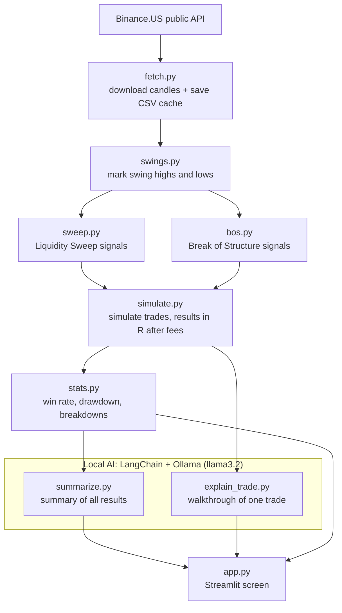

# SMC AI Backtester

A Streamlit app that tests two rule-based Smart Money Concepts trading setups on real crypto price history, then has a local AI explain the results in plain English.

<!-- TODO: add docs/images/app-overview.png -->

---

## What it does

Traders often share "setups": patterns on a price chart that are supposed to signal a good moment to buy or sell. Most of these claims are never tested. This app tests them.

You pick a coin (for example, Bitcoin), a candle size, a date range, and one of two setups. The app then:

1. **Downloads real price history** from the free Binance.US public API.
2. **Finds every moment the setup appeared**, using strict written rules instead of eyeballing a chart.
3. **Pretends to take each trade** and follows it candle by candle until it hits its profit target or its stop loss.
4. **Scores the results**: how many trades won, the average result, and the worst losing streak, all after trading fees.
5. **Asks a local AI to explain the results** in a short paragraph, including a warning when there are too few trades to trust.

Everything runs on your own computer. There are no paid services, no API keys, and no account sign-ups.

> **This is an educational project, not financial advice.** Results on past data do not predict future results.

---

## Smart Money Concepts in 60 seconds

**Smart Money Concepts (SMC)** is a popular trading style built on one idea: big players (banks, funds, "smart money") move prices, and they leave footprints on the chart that smaller traders can learn to read.

**Liquidity.** Big players need someone on the other side of their orders. Many small traders place their stop losses just past obvious highs and lows. Those clusters of waiting orders are called *liquidity*, and SMC traders believe big players deliberately push price into them.

**Swing highs and swing lows.** A *swing high* is a peak: a candle whose high is higher than the candles on both sides of it. A *swing low* is the mirror image, a valley. These are the "obvious" levels where stop losses pile up.

**Liquidity sweep vs. break of structure.** Both setups start with price pushing past a swing level. What happens next is the difference:

| Setup | What price does | What it suggests | Trade direction |
| --- | --- | --- | --- |
| **Liquidity sweep** | Pokes past the level, then **closes back on the original side** | The move was a stop-loss grab, and price may reverse | Against the poke (reversal) |
| **Break of structure (BOS)** | **Closes past the level** | The trend is genuinely continuing | With the break (continuation) |

The short way to remember it: **a sweep comes back, a BOS stays.**

---

## Features

- **Two setups to test.** Choose Liquidity Sweep or Break of Structure from the sidebar.
- **Any Binance.US trading pair** and four candle sizes: 15 minutes, 1 hour, 4 hours, and 1 day.
- **Smart caching.** Downloaded candles are saved to disk, so re-running the same test is instant.
- **Interactive candlestick chart** with a dot at every trade entry: green for wins, red for losses, gray for trades still open when the data ended. A caption explains how to read it.
- **Headline numbers.** Closed trades, win rate (with the breakeven win rate on hover), average result, total result, and worst drawdown.
- **Low-sample warning.** Fewer than 30 closed trades triggers a visible warning that the results are a rough early look.
- **AI summary** of the whole backtest, written by a local model.
- **Breakdowns** of results by trading session, trend direction, and long vs. short.
- **"Explain a trade."** Pick any single trade from a list, and the local AI walks you through it. A line of exact facts from the code sits underneath, so anyone can check the AI's wording.
- **Full trades table** with a plain-English tooltip on every column header.
- **Works without the AI.** If Ollama is not running, the app shows a plain summary written by code instead of crashing.

<!-- TODO: add docs/images/chart-and-metrics.png -->
<!-- TODO: add docs/images/ai-summary.png -->
<!-- TODO: add docs/images/explain-a-trade.png -->
<!-- TODO: add docs/images/column-tooltips.png -->

---

## How it works

The app is a pipeline: each step does one job and hands its output to the next. `src/pipeline.py` is the only file that knows the running order.



What each file does:

- **`src/data/fetch.py`** downloads candles from Binance.US one page of 1,000 at a time and caches them as CSV files in `data/cache/`.
- **`src/detection/swings.py`** marks swing highs and lows, and records the most recent one each candle is allowed to know about.
- **`src/detection/sweep.py`** flags liquidity sweeps and sets a stop loss just past the sweep's wick.
- **`src/detection/bos.py`** flags the first close past a swing level and sets a stop loss past the opposite swing.
- **`src/backtest/simulate.py`** turns signals into trades and walks each one forward until its stop or target is hit.
- **`src/backtest/stats.py`** scores closed trades and labels each trade with its trading session.
- **`src/pipeline.py`** runs the steps in order and holds the menu of available setups.
- **`src/llm/summarize.py`** formats the results into facts and asks the local AI to write a summary paragraph.
- **`src/llm/explain_trade.py`** formats one trade into facts and asks the local AI to explain it.
- **`app.py`** is the Streamlit screen: inputs, chart, numbers, and text. It contains no trading logic.

---

## The trading rules

These are the exact rules the code follows. Bearish (short) versions mirror the bullish (long) ones. Numbers in the table come from `src/config.py`.

| Rule | Exactly what the code does |
| --- | --- |
| **Swing high** | A candle's high is strictly greater than the highs of the 2 candles before it and the 2 candles after it (`SWING_LOOKBACK = 2`). |
| **Swing low** | The mirror: a candle's low is strictly lower than the lows of the 2 candles on each side. |
| **When a swing is usable** | Only after the last confirming candle has closed. A swing is first visible to the candle *after* that, and stays the "prior swing" until a newer one is confirmed. |
| **Bullish sweep (long)** | The candle's low goes **below** the prior swing low, **and** its close is back **above** that swing low. |
| **Bearish sweep (short)** | The candle's high goes **above** the prior swing high, **and** its close is back **below** it. |
| **Bullish BOS (long)** | The candle **closes above** the prior swing high, the **previous candle closed at or below** it (so only the *first* close counts), and a prior swing low exists for the stop. |
| **Bearish BOS (short)** | The candle closes below the prior swing low, the previous candle closed at or above it, and a prior swing high exists for the stop. |
| **Entry** | The **open of the next candle** after the signal candle. |
| **Stop (sweep)** | Just past the sweep wick: the signal candle's low minus a buffer for longs, or its high plus a buffer for shorts. |
| **Stop (BOS)** | Just past the opposite swing: the prior swing low minus a buffer for longs, or the prior swing high plus a buffer for shorts. |
| **Stop buffer** | The signal candle's close × 0.05% (`STOP_BUFFER_PCT = 0.0005`), so tiny noise does not trigger the stop. |
| **Target** | Entry ± 2 × risk (`RR_TARGET = 2.0`), where risk is the distance from entry to stop. |
| **No valid stop** | If there is no stop level, or the entry already sits past the stop, there is **no trade**. |
| **Same candle hits stop and target** | The **stop wins**. A single candle doesn't show which price came first, so the code assumes the worst. |
| **Data runs out** | The trade closes at the last candle's close and is marked `open`. Open trades are reported but **not scored**. |
| **One trade at a time** | The search for the next signal starts only after the current trade has closed. |
| **Fees** | A 0.1% round-trip fee (`FEE_PCT = 0.001`) is converted into R and subtracted from every trade. |

---

## Keeping the backtest honest

A backtest is easy to fool, usually by accident. These safeguards are built into the code, and each one has a test.

- **No look-ahead.** The code never uses a candle's data before that candle has closed. A swing high needs 2 later candles to confirm it, so it stays hidden until those candles have closed. The `test_no_look_ahead` test fails if this ever breaks.
- **Next-candle entry.** A setup is only known once its candle has closed, so the trade enters at the *next* candle's open, never at a price from the past.
- **Stop wins ties.** When one candle touches both the stop and the target, the trade is counted as a loss.
- **Fees included.** Every result has the trading fee subtracted. Ignoring fees makes almost any strategy look better than it is.
- **Low-sample warning.** With fewer than 30 closed trades (`MIN_TRADES_FOR_CONFIDENCE`), the results are flagged as unreliable on screen and in the AI summary.

### What "R" means

Results are measured in **R**, short for "units of risk". **1R is the amount you would lose if the trade hit its stop.**

- A trade that hits its target makes about **+2R**: twice what was risked.
- A trade that hits its stop loses about **−1R**.
- Fees shave a little off every trade, so a real win is slightly under +2R and a real loss slightly worse than −1R.

R makes results comparable across any account size or coin price. It also gives a quick sanity check. With a 2R target, one win pays for two losses, so the setup must win more than **1 in 3 trades (33.3%)** just to break even before fees.

---

## How the AI stays honest

Small local language models write well but are unreliable at math, and they sometimes *hallucinate*: they state things that aren't true. So the jobs are split:

- **Code decides every fact.** All math, percentages, prices, durations, the profit verdict, and the low-sample warning are computed and formatted by Python.
- **The AI only does the writing.** It receives finished facts plus strict rules, such as "use only the numbers provided" and "never predict the future", and turns them into friendly sentences.

### Three AI mistakes caught during development

| Mistake | Fix |
| --- | --- |
| The AI mentioned a "small sample" warning even when there were plenty of trades. | The code now sends the word `WARNING` only when the sample really is too small, and the AI is told to mention a warning only when one is given. A test checks that a large sample never contains `WARNING`. |
| The AI decided whether a setup "made money" from the win rate. A win rate above breakeven can still lose money once fees are included. | The code now writes a **verdict** from the average result after fees, and the AI must repeat that verdict instead of judging for itself. A test covers a 36.4% win rate that still loses money. |
| When explaining a single trade, the AI said a winning trade "stopped out" at its stop price. | A line of **exact facts from code** now appears under every AI explanation, labeled as AI-written, so readers can check it. |

### When Ollama is off

If Ollama isn't running or the model isn't downloaded, the AI call fails safely. The app shows a plain summary or trade explanation written entirely by code, starting with "AI unavailable". The rest of the app keeps working. When a backtest finds no closed trades, the AI isn't called at all.

---

## Example results

These come from running the Liquidity Sweep setup on Bitcoin with 1-hour candles. The same settings are built into `scripts/run_demo.py`.

| Setting | Value |
| --- | --- |
| Setup | Liquidity Sweep |
| Pair | BTCUSDT |
| Candle size | 1h |
| Dates | 2025-01-01 to 2026-10-01 |

| Result | Value |
| --- | --- |
| Closed trades | 907 |
| Win rate | 36.3% |
| Average result **before** fees | +0.09R per trade |
| Fees | about 0.36R per trade |
| Average result **after** fees | −0.27R per trade |

**What this shows:** the setup wins slightly more often than the breakeven rate, and before fees it has a small edge. But the stops on 1-hour sweeps are so close to the entry that the 0.1% fee costs over a third of the risk on every trade. After fees, the setup loses money. With 907 trades, this is a large enough sample to take seriously. This exact situation is why the profit verdict is based on the average result after fees, not the win rate.

---

## Tech stack

| Tool | Used for | Why it was chosen |
| --- | --- | --- |
| **Python 3.14** | Everything | Readable, and the standard language for data work. |
| **uv** | Dependencies and virtual environment | Fast installs and a lockfile (`uv.lock`), so everyone gets the exact same package versions. |
| **pandas + NumPy** | Candle tables and signal detection | Rules like "low below swing low AND close above it" run on whole columns at once, which is fast and reads like the rule itself. |
| **requests** | Calling the Binance.US API | Simple and reliable for plain HTTP requests. |
| **Binance.US public API** | Historical candles | Free, no API key, and accessible from the US. |
| **Streamlit** | The web app | A full interactive UI in pure Python, with no HTML or JavaScript needed. |
| **Plotly** | Candlestick chart | Interactive zooming, hovering, and legend toggling out of the box. |
| **LangChain (core)** | Prompt templates and model calls | Keeps prompts as clean templates and lets tests swap in a fake model, so tests run in milliseconds without Ollama. |
| **Ollama + llama3.2** | The local AI | Free and open-source, runs entirely on your machine, and needs no API key or internet connection. |
| **pytest** | Tests | The standard Python test runner, with simple fixtures for fake data. |
| **Ruff** | Linting and formatting | One very fast tool that catches common bugs and keeps code style consistent. |

---

## Project structure

```text
.
├── .gitignore                  # Ignores the venv, caches, and downloaded candles
├── .streamlit/
│   └── config.toml             # Dark theme colors for the app
├── CLAUDE.md                   # Rules and guardrails for AI coding assistants
├── README.md                   # This file
├── app.py                      # Streamlit screen: inputs, chart, numbers, AI text
├── data/
│   └── cache/
│       └── .gitkeep            # Keeps the folder; downloaded CSVs are git-ignored
├── docs/
│   └── .gitkeep                # Placeholder for docs and screenshots
├── pyproject.toml              # Project info, dependencies, Ruff and pytest settings
├── requirements.txt            # Plain dependency list for pip users
├── scripts/
│   ├── __init__.py
│   └── run_demo.py             # Runs one full backtest in the terminal
├── src/
│   ├── __init__.py
│   ├── backtest/
│   │   ├── __init__.py
│   │   ├── simulate.py         # Signals in, trades out (entry, stop, target, R)
│   │   └── stats.py            # Win rate, drawdown, breakdowns, sessions
│   ├── config.py               # Every tunable number in one place
│   ├── data/
│   │   ├── __init__.py
│   │   └── fetch.py            # Downloads and caches candles from Binance.US
│   ├── detection/
│   │   ├── __init__.py
│   │   ├── bos.py              # Break of structure signals
│   │   ├── sweep.py            # Liquidity sweep signals
│   │   └── swings.py           # Swing highs/lows with no look-ahead
│   ├── llm/
│   │   ├── __init__.py
│   │   ├── explain_trade.py    # AI explanation of one trade
│   │   └── summarize.py        # AI summary of all results
│   └── pipeline.py             # Runs the steps in order; menu of setups
├── tests/
│   ├── __init__.py
│   ├── conftest.py             # Shared helper that builds fake candles
│   ├── test_bos.py
│   ├── test_explain_trade.py
│   ├── test_fetch.py           # Uses a fake network, so no internet needed
│   ├── test_pipeline.py
│   ├── test_simulate.py
│   ├── test_stats.py
│   ├── test_summarize.py
│   ├── test_sweep.py
│   └── test_swings.py          # Includes the no-look-ahead test
└── uv.lock                     # Exact locked versions of every dependency
```

`src/` is pure logic with no Streamlit code, so every rule can be tested without starting the app.

---

## Getting started

### Prerequisites

- **Python 3.14 or newer.** This is required by `pyproject.toml`.
- **[uv](https://docs.astral.sh/uv/)** to install dependencies.
- **[Ollama](https://ollama.com/)** to run the local AI. This is optional: the app works without it, but shows plain code-written text instead of AI summaries.

### Install and run

```bash
# 1. Get the code
git clone https://github.com/Quasheana226/smc-ai-backtester.git
cd smc-ai-backtester
git checkout develop   # main is updated at release time; develop has the latest work

# 2. Install Python dependencies into a local virtual environment
uv sync

# 3. Download the local AI model (about 2 GB, one time only)
ollama pull llama3.2

# 4. Start the app
uv run streamlit run app.py
```

Streamlit opens the app in your browser. Pick your settings in the sidebar, then click **Run backtest**. The first run for a new pair or date range downloads candles from Binance.US, so it needs an internet connection. Later runs use the cache.

---

## Running tests and checks

```bash
uv run pytest                  # All tests (40); no internet or Ollama needed
uv run ruff check .            # Lint: catches bugs and unsorted imports
uv run ruff format --check .   # Confirms the code is formatted
uv run python -m scripts.run_demo   # One real backtest printed in the terminal
```

The demo script uses the settings from the [example results](#example-results). It needs an internet connection the first time, and it uses Ollama for the summary if Ollama is running.

---

## Configuration

Every tunable number lives in `src/config.py`. Change a value there, and the whole app picks it up.

| Setting | Current value | What it does |
| --- | --- | --- |
| `KLINES_URL` | `"https://api.binance.us/api/v3/klines"` | Where candles are downloaded from. Binance.US is used because Binance.com blocks US users. |
| `MAX_CANDLES_PER_REQUEST` | `1000` | Candles per API request, the API's maximum. Longer ranges are fetched in pages. |
| `REQUEST_PAUSE_SECONDS` | `0.2` | Pause between page requests, to be a polite API client. |
| `SUPPORTED_TIMEFRAMES` | `["15m", "1h", "4h", "1d"]` | Candle sizes offered in the app. |
| `CACHE_DIR` | `"data/cache"` | Folder where downloaded candles are saved. |
| `SWING_LOOKBACK` | `2` | Candles required on each side of a swing high or low. |
| `STOP_BUFFER_PCT` | `0.0005` | Extra room past the stop level (0.05% of price), so tiny noise does not stop the trade out. |
| `RR_TARGET` | `2.0` | Profit target as a multiple of risk. 2.0 means risk $1 to make $2. |
| `FEE_PCT` | `0.001` | Round-trip trading fee (0.1%), subtracted from every trade. |
| `TREND_SMA_PERIOD` | `50` | Moving-average length for the trend label: "up" if price is above its 50-candle average. |
| `MIN_TRADES_FOR_CONFIDENCE` | `30` | Below this many closed trades, results are flagged as low sample. |
| `OLLAMA_MODEL` | `"llama3.2"` | The local AI model Ollama runs. |
| `OLLAMA_TEMPERATURE` | `0.2` | How "creative" the AI is, from 0 to 1. Kept low so it sticks to the facts. |

---

## Git workflow

- **`main`** holds released, stable code.
- **`develop`** is where finished features come together.
- **Work branches** start from `develop` and use a prefix: `feature/` for new features, `fix/` for bug fixes, and `docs/` for documentation.
- Each work branch is merged into `develop` through a pull request. `develop` is merged into `main` for a release.

```text
feature/explain-trades ─┐
feature/streamlit-ui ───┼──> develop ──> main
fix/missing-summary-test┘
```

Commit messages follow [Conventional Commits](https://www.conventionalcommits.org/), so the history reads like a changelog:

```text
feat: add column tooltips and AI trade explainer
fix: only mention sample warning when the facts contain WARNING
test: add trade simulation tests for target, stop, tie, and no-stop
style: apply ruff format across the project
```

---

## Limitations and disclaimer

- **Past results are not future results.** A setup that worked on past data can stop working at any time.
- **Simplified session hours.** Trading sessions are fixed UTC hours: Asia 00:00 to 06:59, London 07:00 to 12:59, New York 13:00 to 20:59, and Off-hours 21:00 to 23:59. Daylight saving time and holidays are ignored.
- **A flat 0.1% fee assumption.** Real fees vary by exchange and account level.
- **Perfect fills.** Stops and targets fill at exactly their price. Real trades can suffer *slippage*, especially when price jumps past a stop.
- **Candle-level detail only.** The simulator can't see price moves inside a candle, which is why it assumes the stop was hit first in a tie.
- **One data source.** Candles come only from Binance.US, whose prices can differ slightly from other exchanges.

> **Not financial advice.** This project is for learning about backtesting, software engineering, and responsible AI use. Do not trade real money based on it.

---

## Roadmap

- [ ] **Wider stops and a 4-hour test.** Check whether giving trades more room, or using bigger candles, shrinks the fee cost per trade enough to turn a profit.
- [ ] **Out-of-sample check.** Tune on one period and confirm on a separate, unseen period, to guard against overfitting.
- [ ] **Equity curve.** A chart of the running total of R over time.
- [ ] **Results chat.** Ask the local AI follow-up questions about a backtest.
- [ ] **Voice readout.** Have the summary read aloud.

---

## Acknowledgments

- Built as part of the **Per Scholas AI Solutions Developer** program.
- Built with **[Claude Code](https://claude.com/claude-code)** as a pair programmer. The rules in `CLAUDE.md` kept it working to the project's spec: no look-ahead, tests with every change, and free tools only.
